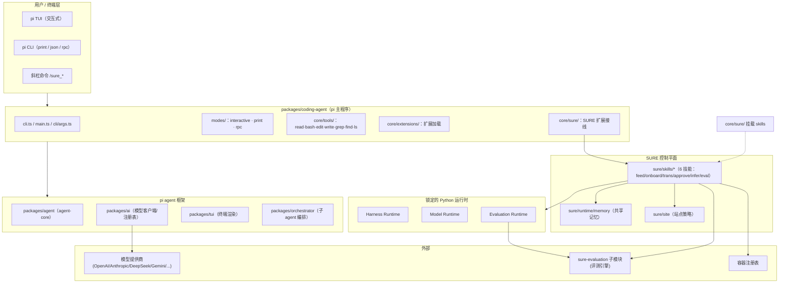
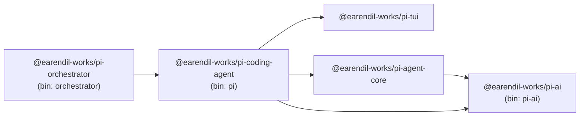
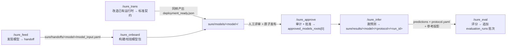
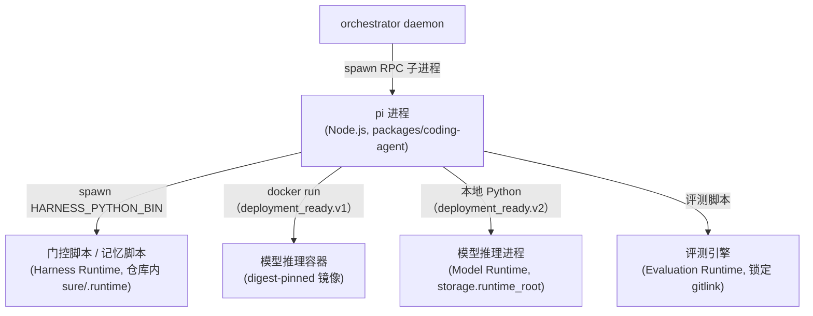
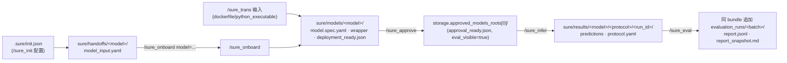
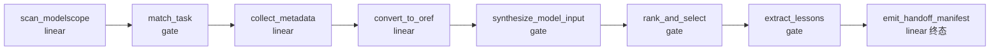
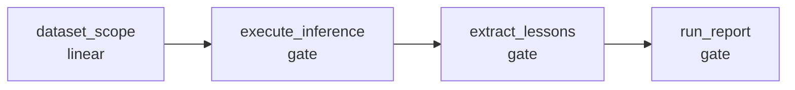
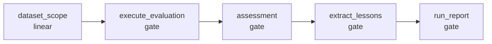
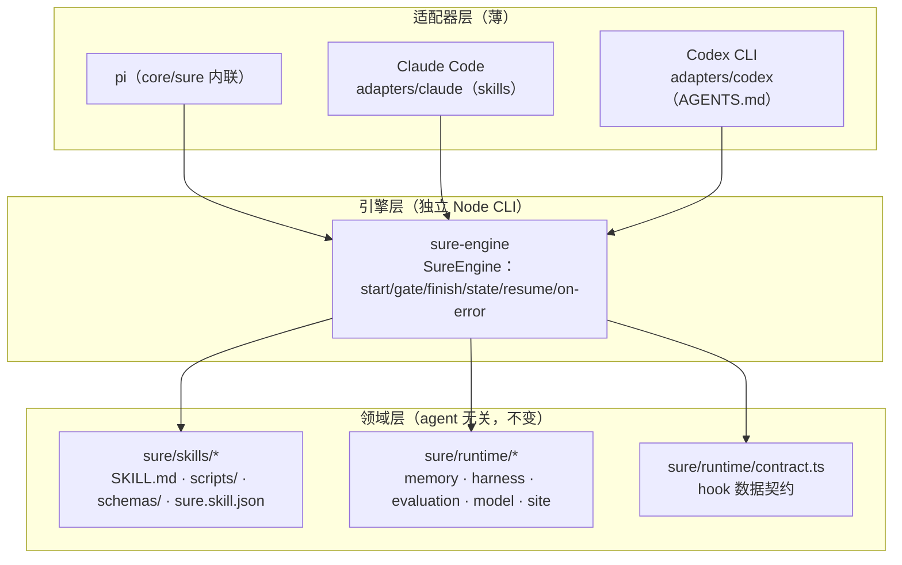

# SURE Harness 深度架构分析与使用手册

> 面向模型上载（onboarding）与评测（evaluation）的 agent 化、系统级控制平面。
> 本文档覆盖：项目概述、总体架构（架构图 + 命令行接口）、各模块概要及详细设计、完整使用手册。
> 基于分支 `harness-tui-agent`（`d6df59a`）生成。

---

## 目录

1. [项目概述](#1-项目概述)
2. [总体架构](#2-总体架构)
3. [模块详解](#3-模块详解)
4. [命令行接口（CLI 参考）](#4-命令行接口cli-参考)
5. [使用手册](#5-使用手册)
6. [附录](#6-附录)
7. [多 Agent 运行与解耦（sure-engine）](#7-多-agent-运行与解耦sure-engine)

---

## 1. 项目概述

SURE Harness 是一个基于 **pi agent 框架** 构建的、面向**可复现模型上载与评测**的系统级控制平面。它把模型部署、环境适配、推理代码生成、数据集评测，收敛为一套**可审计的工作流**：运行时身份、依赖锁、参数、模型绑定、预测结果、指标路由与报告都以结构化证据留存，使一次实验比一串未经记录的 shell 命令更容易复现、比较与信任。

### 1.1 定位

- **底层**：pi monorepo（`@earendil-works/pi-*`，5 个包共享版本 `0.80.3`），一个多 provider 的 AI 编码助手（CLI + TUI），原生具备 read/bash/edit/write/grep/find/ls 工具、会话管理、扩展机制。
- **上层**：SURE 控制平面，以**结构化斜杠命令（slash commands）** 的形式，让 Codex、DeepSeek、Kimi Code 等编码 agent 通过 TUI 工作流驱动模型上载与评测。

### 1.2 两种发行形态（同一代码库）

| 形态 | 站点策略 | 说明 |
| --- | --- | --- |
| 捆绑站点策略发行版 | `config/site.bundled.yaml` | 自带可信站点策略，用户无需本地建策略即可跑工作流 |
| 公共 / 自托管发行版 | 无（用户自建 `config/site.local.yaml`） | 用户自行配置存储根、执行面等边界 |

两者共享：公共核心、命令参数、状态机、门控（gates）、运行时锁、产物 schema、评测配置优先级。站点策略只提供部署相关的根路径与执行资源，不改变工作流行为。

### 1.3 技术栈

- **语言/运行时**：Node.js ≥ 22.19（TypeScript，erasable/strip-only 模式，`tsgo` 构建到 `dist/`）；Python 3.11（三个锁定的 Python 运行时）。
- **包管理**：npm workspaces（monorepo，`type: module`，ESM）。
- **评测引擎**：`sure/external/sure-evaluation` Git 子模块（经 `runtime.json` 锁定 gitlink）。
- **许可**：MIT。

### 1.4 核心概念：三层运行时

SURE 把「Python 运行时」严格区分为三种互不混用的运行时：

| 运行时 | 位置 | 职责 | 锁定方式 |
| --- | --- | --- | --- |
| **Harness Runtime** | `sure/runtime/harness/` | 执行门控脚本、hook 辅助脚本（stdlib + yaml/structlog/pydantic/rich/typer） | `runtime.json` + `requirements.lock.txt` |
| **Model Runtime** | `sure/runtime/model/`（物化到站点 `storage.runtime_root/models/`，内容寻址） | 模型本地推理环境（torch 等），由 `uv` + 哈希锁定 requirements 物化 | 密封清单 + 模型核心哈希 |
| **Evaluation Runtime** | `sure/runtime/evaluation/` | 锁定版 sure-evaluation 引擎（regex/sacrebleu/numpy/pydantic/typer…） | `runtime.json`（engine_commit + engine_pyproject_sha256） |

这种「三分法」贯穿所有技能：每个技能在 `runtime_binding.json` 里显式声明本次运行绑定哪几个运行时、并证明不绑定哪几个（例如 `sure_feed` 只绑定 Harness Runtime、显式标记 Model/Evaluation 运行时「不需要」；`sure_eval` 绑定 Harness + Evaluation、证明「不用 Model Runtime」）。

---

## 2. 总体架构

### 2.1 分层架构图



### 2.2 包依赖关系



分层：`ai`（统一 LLM API）与 `tui`（差分渲染终端 UI）是最底层；`agent` 依赖 `ai` 提供 agent loop/harness；`coding-agent` 汇总 `agent`+`ai`+`tui`，是 `pi` CLI 最终产品；`orchestrator` 依赖 `coding-agent`，作为 daemon 管理多个 pi 实例。

### 2.3 六命令流水线（数据流）



`sure_trans` 是 `/sure_onboard` 的并列替代路径（针对已有交付环境与推理代码、但尚未实现 SURE ModelWrapper/MCP 契约的模型），两者终态产物一致（`deployment_ready.json`）。

### 2.4 架构的命令行接口

架构的「命令行接口」分两层：

1. **`pi` 二进制**（`packages/coding-agent`，`bin: pi -> dist/cli.js`）：进入 agent 会话的入口，支持三种模式与全套 flag（见 §4）。
2. **斜杠命令**（会话内输入）：内置 22 个（`settings/model/session/export/...`）+ SURE 命令 9 个（`/sure_init`、`/sure_resume`、`/sure` 状态查询 + 6 个 skill 命令）+ 2 个门控工具（`sure_finish`、`sure_update_state`）。斜杠命令由 `packages/coding-agent/src/core/sure/` 接线层发现、挂载并执行 hook 状态机。

### 2.5 运行生命周期与工具门控（控制平面核心）

SURE 把「一次技能运行」变成一台由 hook 驱动的状态机。`SureRunManager` 管理运行，`SureHookRunner` 在六个生命周期点执行技能声明的 hook，任何 hook 返回 `ok:false`（或带 `repair`）即触发门控失败。

```mermaid
sequenceDiagram
    autonumber
    participant U as Agent / 用户
    participant RM as SureRunManager
    participant HK as SureHookRunner
    participant T as 工具执行

    U->>RM: /sure_* 命令（startRun）
    RM->>RM: createRun：.sure/runs/&lt;runId&gt;/
    RM->>HK: pre_start 钩子
    alt pre_start 失败
        RM->>RM: run 标记 failed，不启动 turn
    else 通过
        RM->>RM: setActiveTools（门控当前工具集）
        RM->>U: 注入 &lt;sure_invocation&gt; 提示
        loop agent turn（直到 sure_finish）
            U->>T: 调用工具（非 sure_finish）
            T->>HK: pre_tool_call 钩子
            alt 失败
                HK-->>T: block:true（拦截执行）
            else 通过
                T->>T: 执行工具
                T->>HK: post_tool_result 钩子
            end
        end
        U->>HK: sure_finish（结束信号）
        HK->>HK: 校验 manifest → pre_finish → post_finish
        HK-->>U: terminate:true
    end
```

关键机制（详细见 §3.11 引言与各技能）：

- **工具门控**：`extension.ts` 订阅 `tool_call`/`tool_result`/`agent_end`/`session_shutdown` 事件。`pre_tool_call` 失败以 `{block:true}` 阻止工具执行；`preToolCall` 还按「当前单元脚本白名单」放行 `scripts/*.py`，越序调用即拦截。
- **状态机三闸门**：① checkpoint 锁（一次只前进一步）；② `validateProduces`（每个单元产物做结构校验）；③ gate 单元跑 Python 语义脚本（exit 0 = 通过）。
- **结束门控**：`agent_end` 时若 run 仍 `running` 且未 `willRetry`，记录 stale 状态并提示 `/sure_resume`；headless 模式自动追加最多 3 次续跑 nudge。`sure_finish` 触发 manifest 校验 + `pre_finish`/`post_finish`，`terminate:true` 结束。
- **续接**：`/sure_resume` 按 checkpoint `resumable===true` 恢复，不重跑 `pre_start`（保护已有进度）。

### 2.6 进程与执行拓扑（三运行时）

一次运行中，`pi` 进程按技能需求把工作派发给**互不混用的执行面**，每个执行面对应一个锁定运行时：



- **Harness Runtime** 只跑门控/记忆脚本（stdlib + yaml/pydantic/rich/typer），绝不跑模型推理。
- **模型推理**走两个执行面：默认 Docker registry 交付（`deployment_ready.v1`，digest-pinned 镜像）；或站点批准的密封本地 Python（`deployment_ready.v2`，内容寻址 Model Runtime，仅当 `execution.local_runtimes` 含 `python`）。
- **Evaluation Runtime** 只被 `/sure_eval` 锁定并使用（引擎 gitlink + pyproject 哈希）。
- 每个技能在 `runtime_binding.json` 里证明自己绑定了哪些运行时、没绑定哪些（跨技能的可审计声明）。

### 2.7 产物与目录拓扑



| 目录 | 内容 | 生产者 / 消费者 |
| --- | --- | --- |
| `.sure/runs/<runId>/` | `run.json`、`state.json`（checkpoint）、`events.jsonl`、`logs/`、`artifacts/` | SureRunManager / 所有 hook |
| `.sure/init.json` | 模型 provider 与认证配置 | `/sure_init` |
| `sure/handoffs/<model>/` | `model_input.yaml` + 证据 | `/sure_feed` → `/sure_onboard` |
| `sure/models/<model>/` | `model.spec.yaml`、wrapper、`artifacts/deployment_ready.json`、fixture、`.runtime/`、checkpoints | `/sure_onboard`、`/sure_trans` → `/sure_approve` |
| `storage.approved_models_roots[0]` | 原子发布的批准 bundle + `approval_ready.json` | `/sure_approve` → `/sure_infer` |
| `sure/results/<model>/<protocol>/<run_id>/` | predictions、`protocol.yaml`、参考投影 | `/sure_infer` → `/sure_eval` |
| `sure/memory/` | `index.json`、`provisional/`、`usage/`、`digests/`（git-ignored、组可写） | 记忆系统 |
| `sure/.runtime/harness/<runtime_id>` | Harness Runtime 物化产物 | `bootstrap.py` |
| `storage.runtime_root/models/<runtime_id>` | 内容寻址 Model Runtime | `sure/runtime/model/bootstrap.py` |

### 2.8 设计边界（Harness 拥有 vs 技能拥有）

| Harness 拥有 | 技能包拥有 |
| --- | --- |
| 斜杠命令发现、运行生命周期、状态持久化 | 领域 prompt、确定性脚本 |
| Hook 执行、工具门控、最终 manifest 校验 | 状态机、schema、检查点 |
| 共享运行时契约 | 校验规则与修复指引 |

原则：任务特定指标、数据集假设、SURE 业务逻辑不得下沉进公共 harness，除非该规则真正被**每个**技能共享。这一边界保证「换一个评测引擎/换一个站点」不污染可移植的控制平面。

---

## 3. 模块详解

> 每个模块给出「概要」（用途 + 关键入口）与「详细设计」（子模块/关键文件/交互）。文件路径以仓库根为基准。

### 3.1 packages/agent（`@earendil-works/pi-agent-core`）

**概要**：通用智能体核心库（agent loop + harness），提供 LLM 无关的传输抽象、状态管理、附件支持。被 coding-agent 与 orchestrator 复用。

**详细设计**：
- `src/agent.ts`：有状态 `Agent` 类（事件/队列/abort）。
- `src/agent-loop.ts`：底层 `runAgentLoop` / `agentLoop` 事件流（「思考-行动」循环）。
- `src/types.ts`：对外类型（含 `ThinkingLevel` 等）。
- `src/proxy.ts`：proxy 工具（工具代理/转发）。
- `src/harness/`：会话装配层——`agent-harness.ts`、`session/`（会话）、`compaction/`（上下文压缩、分支摘要）、`skills`、`system-prompt`、`prompt-templates`、`messages`、`env/nodejs`（`NodeExecutionEnv`）、`utils`。

**公开面**：`main: ./dist/index.js`；`src/index.ts` 导出 `Agent`、`runAgentLoop`、`agentLoop`、`AgentHarness`、`compact` 系列、session/skills、类型；`src/node.ts` 子路径 `./node` 额外导出 `NodeExecutionEnv`。

**依赖**：`@earendil-works/pi-ai`、`ignore`、`typebox`、`yaml`。

### 3.2 packages/ai（`@earendil-works/pi-ai`）

**概要**：统一 LLM API 层，模型发现与 provider 配置，覆盖 30+ 提供商（Anthropic/OpenAI/DeepSeek/Gemini/Groq/Kimi/Moonshot/Bedrock/Cloudflare…），并支持 OAuth、图片生成。

**详细设计**：
- `src/models.ts`：`Provider`/`Models`、`createModels`/`createProvider` 新 API。
- `src/types.ts`：类型。
- `src/providers/`：30+ provider 工厂（`<name>.ts` + `<name>.models.ts`，`all.ts` 聚合、`faux.ts` 假 provider、`images/`）。
- `src/api/`：各 API 流式实现（含 `*.lazy.ts` 懒加载）。
- `src/auth/`：认证/OAuth。
- `src/utils/`：`oauth/`、`event-stream`、`retry` 等。
- `src/compat.ts`、`src/legacy-api-aliases.ts`：兼容层与旧 API 别名（`stream/complete/streamSimple/getModel(s)/getProviders/registerFauxProvider`）。
- `src/cli.ts`：`pi-ai` 二进制（`bin: pi-ai`，login/list OAuth 命令）。
- 模型目录：`models.generated.ts` / `image-models.generated.ts`。

**公开面**：`main: ./dist/index.js`（无副作用核心）；子路径 `./compat`、`./providers/*`、`./api/*`、`./oauth`、`./bedrock-provider`；`bin: pi-ai`。

**依赖**：`openai`、`@anthropic-ai/sdk`、`@google/genai`、`@aws-sdk/client-bedrock-runtime`、`@mistralai/mistralai`、`typebox`、`partial-json` 等（无内部依赖）。

### 3.3 packages/coding-agent（`@earendil-works/pi-coding-agent`）

**概要**：面向用户的 `pi` 主程序。解析 CLI、装配 agent 会话、提供 TUI/print/rpc 三种模式、内置工具、扩展机制，并**挂载 SURE 控制平面**。

**详细设计**：
- `src/cli.ts`：bin 入口（`#!/usr/bin/env node` → `main()`）。
- `src/main.ts`（854 行）：主逻辑——先处理子命令 → `parseArgs` → 按模式分发。
- `src/cli/`：`args.ts`（参数解析）、`file-processor.ts`、`initial-message.ts`、`list-models.ts`、`session-picker.ts`、`startup-ui.ts`、`project-trust.ts`、`config-selector.ts`。
- `src/modes/`：`interactive/`（TUI + `components/` + `theme/`）、`print-mode.ts`（`-p` 单发）、`rpc/`（`rpc-mode.ts`、`rpc-types.ts`、`rpc-client.ts`）。
- `src/core/`：会话（`agent-session.ts`、`agent-session-services.ts`、`session-manager.ts`、`sdk.ts`）、工具（`tools/`：bash/edit/write/read/grep/find/ls）、扩展（`extensions/`）、**SURE 接线**（`sure/`）、压缩（`compaction/`）、导出（`export-html/`）、认证/模型/设置/信任（`auth-storage.ts`、`model-registry.ts`、`model-resolver.ts`、`settings-manager.ts`、`trust-manager.ts`）、`bash-executor.ts`、`event-bus.ts`、`http-dispatcher.ts`、`slash-commands.ts`、`skills/`、`system-prompt/`。
- `src/core/sure/`：SURE 扩展接线层（见 §3.11 引言）——`extension.ts`（挂载/事件订阅）、`module-loader.ts`（jiti 加载 hook + 别名/虚拟模块）、`init*.ts`（/sure_init：菜单、capability probe、gateway store、model listing）、`manifest.ts`（技能发现）、`hooks.ts`、`state.ts`、`run-manager.ts`、`output-dir.ts`、`types.ts`、`hook-types.ts`。
- `src/package-manager-cli.ts`：`pi install/remove/uninstall/update/list/config` 子命令。
- `src/utils/`：图片/剪贴板/git/shell/path 等；`src/bun/`：Bun 二进制入口；`src/config.ts`、`src/migrations.ts`、`src/rpc-entry.ts`。

**公开面**：`bin: pi -> dist/cli.js`；`main: ./dist/index.js`（极宽泛 SDK 面：`parseArgs`/`main`、`AgentSession`、`SessionManager`、`AuthStorage`、`ModelRegistry`、`SettingsManager`、compaction、扩展系统、工具工厂、`createAgentSession*`、`InteractiveMode`/`runPrintMode`/`runRpcMode`/`RpcClient`、UI 组件、theme、utils）；子路径 `./hooks`（`core/sure/hook-types`）、`./rpc-entry`。

**依赖**：`@earendil-works/pi-agent-core`、`@earendil-works/pi-ai`、`@earendil-works/pi-tui` + chalk/diff/glob/jiti/minimatch/typebox/yaml/undici/proper-lockfile/highlight.js/cross-spawn 等。

### 3.4 packages/orchestrator（`@earendil-works/pi-orchestrator`）

**概要**：实验性 orchestrator，以 daemon 管理多个 pi coding-agent 实例（Unix socket IPC）。

**详细设计**：
- `src/cli.ts`：`orchestrator` 二进制入口（`bin: orchestrator`）。
- `src/serve.ts`：IPC daemon（spawn/list/status/stop/rpc/rpc-stream）。
- `src/supervisor.ts`：`OrchestratorSupervisor` 编排核心。
- `src/handler.ts`：请求处理。
- `src/ipc/`：进程间通信（`protocol.ts`、`server.ts`、`client.ts`）。
- `src/rpc-process.ts`：`RpcProcessInstance`——每实例 spawn 一个 coding-agent RPC 子进程，桥接会话事件与扩展 UI 请求。
- `src/storage.ts`：实例状态持久化。
- `src/config.ts`：socket 路径、`isBunBinary`。
- `src/radius.ts`：Radius 云 presence。

**公开面**：`src/index.ts` 全量导出；`bin: orchestrator -> dist/cli.js`。

**依赖**：`@earendil-works/pi-coding-agent`（类型 `RpcCommand`/`RpcResponse`/`AgentSessionEvent`、`AuthStorage`、`rpc-entry` 子路径）。

### 3.5 packages/tui（`@earendil-works/pi-tui`）

**概要**：终端 UI 库，差分渲染，供文本界面应用（coding-agent interactive 模式）使用。

**详细设计**：
- `src/tui.ts`（1714 行）：TUI 核心（差分渲染/组件树/overlay/焦点）。
- `src/terminal.ts`：终端抽象（`Terminal`/`ProcessTerminal`）。
- `src/components/`：12 个组件。
- `src/keys.ts` / `src/keybindings.ts` / `src/native-modifiers.ts`：键盘输入与键位。
- `src/stdin-buffer.ts`、`src/word-navigation.ts`、`src/undo-stack.ts`、`src/kill-ring.ts`：输入缓冲/单词导航/撤销/剪切环。
- `src/terminal-image.ts`、`src/terminal-colors.ts`：终端图片/颜色/超链接。
- `src/fuzzy.ts`、`src/autocomplete.ts`：模糊匹配/自动补全。
- `src/editor-component.ts`、`src/utils.ts`。

**公开面**：`main: dist/index.js`（`TUI`、`Component`、`Container`、组件全集、`Key`/`parseKey`、`KeybindingsManager`、`StdinBuffer`、terminal-image/colors、fuzzy、autocomplete、utils）。无 bin。

**依赖**：`get-east-asian-width`、`marked`（无内部依赖，最底层 UI 库）。

### 3.6 sure/runtime/memory（共享记忆系统）

**概要**：跨技能共享的「经验记忆」系统——把每次运行的关键事实、失败修复、抽取教训，结构化地索引、匹配、发布，供后续运行检索复用。它是一台**跨语言状态机**：TypeScript 侧（`match.ts`/`hooks.ts`）跑在 coding-agent hook 生命周期，负责匹配、注入、结算、写 usage 行；Python 侧（纯 stdlib，`python3 -s` 可跑）负责消化 run 事件、门禁校验、发布、建索引、升降级、留存。

**详细设计**：
- `match.ts`（纯读 `sure/memory/index.json`，唯一写 usage jsonl）：`triggerHits()`（全系统唯一触发器谓词，与 `proposals.py:trigger_hits` 同一行、`fixtures/match_vectors.json` 双语言钉死行为）、`matchBadCases()`（gate 拒绝时按 skill+component 匹配）、`matchFacts()`（pre_start 按 scope 匹配）、`applyRecallBudget()`/`buildMemoryBlock()`（召回预算）、`appendUsageRow()`、`redactHostPaths()`（绝对路径掩码为 `<path>`）、`readEventCount()`。
- `hooks.ts`（skill hook 导入它、它不反向导入任何 skill）：`injectOnBlock()`、`settleOnPass()`/`settleOnTerminalFailure()`、`preStartMemory()`、`preFinishExtraction()`/`postFinishMemory()`、`gateDigest()`/`safeGateDigest()`、`buildDigest()`/`onErrorDigest()`、`runMemoryScript()`（只 spawn 各 skill 自己 `scripts/` 下的薄包装）。
- `digest.py`：从 append-only 的 `events.jsonl` 重建 `artifacts/run_digest.json`（extraction agent 看到的唯一视图），路径/URL 掩码、预算阶梯裁剪、任何异常降级为 `{schema,error}`。
- `proposals.py`：extraction 门禁（10 条规则）——schema/枚举/正文校验、触发器纪律、evidence 路径解析、逐字引用校验。
- `publish.py`：把过门禁 candidate 写入 `provisional/<skill>/<slug>/` + meta + decisions 行 + digest 复制；main 串行 publish→promote→rebuild→prune。
- `index.py`：把 git 跟踪 references + `sure/memory/provisional/` 合成 `index.json`/`index.md`，reconcile README 路由表。
- `promote.py`（升降级）、`usage.py`（usage 重放成计数 + `_archive.json` 留存）、`paths.py`（组可写/原子写/锁）、`cli.py`（人类工具：list/show/compare/confirm/export/reject/supersede/stats/fix-perms/rebuild-index）。
- `config.json`（tunables）、`units.json`（每 skill 状态机单元 id）、`log_paths.json`（每 skill/unit 日志定位表）。
- `schemas/`：`index/proposal/run_digest/extraction_declaration/meta` 五个 schema。

**交互**：skill hook → `hooks.ts`/`match.ts` → spawn 各自 `scripts/` 薄包装 → 调用 `memory/*.py` 读写 `sure/memory/`（git-ignored、组可写）。数据流单向：TS 写 usage 行，Python 重放成计数。

### 3.7 sure/runtime/harness（锁定的 Harness Runtime）

**概要**：为所有技能的**门控脚本与 hook 辅助脚本**提供唯一、锁定、可复现、可移植的 Python 解释器。技能不得用模型本地 `.venv` 或宿主任意 Python 跑 harness 脚本。

**详细设计**：
- `runtime.json`：锁定 spec（`harness_version: v1`、`python: 3.11`、`materialization_version: 2`、`required_imports: [yaml, structlog, pydantic, pydantic_settings, rich, typer]`）。
- `requirements.in` → `requirements.lock.txt`：哈希锁定依赖（pydantic 2.13.3 等）。
- `bootstrap.py`：物化流程——读 spec → `runtime_id = sure-harness-v1-py311-<lock_sha256[:12]>` → 拷贝宿主 CPython + stdlib + `ldd` 依赖到 staging → `uv pip sync --require-hashes --strict` 装锁文件 → 写 manifest + import probe → 原子 rename 落地到 `sure/.runtime/harness/<runtime_id>`；失败最多重试 2 次。
- `resolve.ts`：TS 侧解析，`repoRootForPackage()`、`resolveHarnessPython()`（spawn `bootstrap.py --json`）、`activateHarnessRuntime()` 导出 `HARNESS_PYTHON_BIN`、`SURE_EVAL_HARNESS_PYTHON_BIN`、`SURE_HARNESS_RUNTIME_ID`、`SURE_HARNESS_LOCK_SHA256`。
- `build_image.py` + `Dockerfile`：产出 digest-pinned 镜像（写 `runtime-image.json`）。
- `model_child_env.py`：spawn 模型子进程时剥离 harness 解释器泄漏。

**依赖**：`uv`（`SURE_UV_BIN` 可指定）。

### 3.8 sure/runtime/evaluation（锁定的 Evaluation Runtime）

**概要**：锁定版 sure-evaluation 评测引擎的运行时声明与依赖。

**详细设计**：
- `runtime.json`（`schema: sure.evaluation.runtime.spec.v1`）：锁定
  - `engine_commit: b28ad34d048895a469acd87e5f44741d0ede8d10`（= 子模块 gitlink）
  - `engine_pyproject_sha256`（引擎 `pyproject.toml` 的 sha256）
  - `python: 3.11`、`materialization_version: 4`、`dynamic_loader: /lib64/ld-linux-x86-64.so.2`
  - `required_imports`（regex/sacrebleu/numpy/yaml/pydantic/rich/structlog/typer + `sure_eval.evaluation.tasks.asr.pipeline`，probe 后者等价于验证引擎已装）
- `requirements.in` / `requirements.lock.txt`：锁定依赖。
- 三者（gitlink / engine_commit / engine_pyproject_sha256）不一致时，`/sure_eval` 解析 route plan 立即报 `evaluation engine commit differs from the locked runtime`。bump 引擎时 gitlink 与 runtime.json 必须同 commit 一起提交。

### 3.9 sure/runtime/model（Model Runtime）

**概要**：模型本地推理的密封运行时（sealed local Python）。由 `uv` + 哈希锁定 requirements 物化，内容寻址，便携身份随模型 bundle 存证，推理时按站点解析。

**详细设计**：
- `bootstrap.py`：`materialize_runtime()` 用 `uv venv --no-project --no-python-downloads` + `uv pip sync --require-hashes --strict` 构建不可变 `uv_venv`；`runtime_id = sure-model-python-v1-<identity 摘要前 24 位>`（identity 含 base_python_sha256、lock_sha256、ABI、平台、版本）；`verify_runtime()` 按 manifest 逐字段 + probe 校验。
- 落地在站点 `storage.runtime_root/models/<runtime_id>`（与 harness/eval runtime 的仓库内位置互不替代）。
- 仅当站点策略 `execution.local_runtimes` 含 `python`、且用户选 `package=none` 时启用；否则默认 Docker registry 交付。

### 3.10 sure/site（站点策略）

**概要**：加载并校验站点策略（site policy，纯数据 `sure.site.policy.v1`），提供存储根、执行面、数据集根、运行时缓存根、容器命名等部署边界。策略不改变工作流行为，只定义资源。

**详细设计**：
- `loader.ts` / `loader.py`：策略加载（两语言同构）。
- `policy.schema.json`：JSON Schema v2020-12 机器契约。
- `container_delivery.py`：`repository_template` 校验 + `resolve_container_repository`/`resolve_container_image`。
- `container_registry.py`：Docker Registry V2 标签列表（Basic/Bearer 认证），`next_image_version` 按 SemVer 取最高 +1（`0.1.0` 起步）。
- `public.example.yaml`：公开模板（与 `config/site.example.yaml` 一样，只是模板，永不作为隐式生产默认）。

**加载优先级**（固定）：① `SURE_SITE_POLICY` 绝对路径（缺失/相对/不可读/非法一律 fail-closed，不回退）→ ② `config/site.bundled.yaml` → ③ `config/site.local.yaml` → ④ 无策略（资源类工作流 fail-closed）。

**关键字段**（见 `config/site.example.yaml` / `policy.schema.json`）：
- `storage`：`approved_models_roots`（必填，/sure_approve 写、/sure_infer 读）、`approved_results_roots`（可选）、`forbidden_output_roots`（必填）、`runtime_root`（必填）。
- `datasets`：`allowed_source_roots`（必填，key→绝对路径 map）、`projection_root`（可选）。
- `execution`：`surfaces`（`local`/`vc`）、`local_runtimes`（`python`/`container`）、`vc_project`/`vc_partitions`/`vc_default_partition`。
- `network`：`internal_git_host`、`gateway_portal`、`container_registry`。
- `container_delivery`：`repository_template`（必须 `{registry}/` 开头、含 `{model_name}`、可选 `{task}`）。

**校验**（两语言镜像）：未知字段、重复列表值、不支持 surface、相对路径一律拒绝；`vc` 强制 `vc_project`；`repository_template` 强制 `container_registry`。策略文件可含凭据环境变量名，永不含凭据值。

### 3.11 sure/skills/*（六个技能）

> 技能是 SURE 的核心业务单元。每个技能含：`sure.skill.json`（manifest：命令/产物声明）、`SKILL.md`（agent 操作手册）、`hooks/`（`state-machine.ts` 状态机、`index.ts` hook 函数、`checkpoints.ts` 检查点、`validate.ts` 产物校验）、`scripts/`（确定性执行）、`schemas/`（产物契约）、（部分）`references/`、`examples/`。
>
> **统一 hook 声明**（每个 `sure.skill.json` 的 `hooks` 字段完全相同）：`pre_start→preStart`、`pre_tool_call→preToolCall`、`post_tool_result→postToolResult`、`pre_finish→preFinish`、`post_finish→postFinish`、`on_error→onError`，全部指向 `hooks/index.ts`。
>
> **共享 hook 机制**（各技能 `index.ts` 逻辑同构，`checkpoints.ts`/`validate.ts` 几乎同一模板）：
> - 状态机驱动：`checkpoints.ts` 定义 `CheckpointData{currentUnit, completedUnits, retries, blocks, failedArtifactDigests, memory}`，持久化在 `state.json → checkpoint.data`。三个闸门：① checkpoint 锁（一次只前进一步 `advance()`）；② `validateProduces`（每个单元产物结构校验）；③ gate 单元跑 Python 语义脚本。
> - 线性单元（`linear`）由 LLM 自驱（产物合规即推进）；gate 单元由 hook 强制（脚本 exit 0 = 通过，失败 `failOrRetry` 扣重试，默认 3 次耗尽即 FAILED）。
> - `validate.ts validateProduces` 三档：位置/可解析 JSON → 格式（必填字段 + schema 类型）→ 值域（`allowedValues` + schema `enum` + `forbiddenFields` 反「跨步合并」）。
> - `failOrRetry`：基于产物摘要判「未改动不重复扣重试」。
> - `preToolCall`：按单元脚本白名单放行 `scripts/*.py`（仅当前单元的 `gateScript` + `ownedScripts`/`helperScripts`），越序调用即拦截。
> - `preFinish`：校验 runtime_binding + 终态产物 + 状态机是否到达终态单元；非 success 结束还要求 `extraction_declaration.json`。
> - 所有技能 preStart 都解析共享 Harness Runtime（`resolveHarnessPython` → `HARNESS_PYTHON_BIN`），写 `artifacts/runtime_binding.json` 与 `artifacts/memory_context.json`。
>
> **接线**：`packages/coding-agent/src/core/sure/manifest.ts` 扫描 `.sure/skills/` 与 `sure/skills/`，校验 `sure.skill.json`（command 必须 ∈ 六者、prompt 文件存在、hook module 存在且在包内、同 command 去重、项目级覆盖仓库级）；`default-extensions.ts` 把 `sureExtension` 作为默认扩展工厂注入每次会话；`extension.ts` 订阅 `tool_call`/`tool_result`/`agent_end`/`session_shutdown` 做门控；`module-loader.ts`（jiti）加载 hook 模块并提供别名/虚拟模块；`run-manager.ts` 管理 runId=`<timestamp>-<uuid8>`、落盘 `.sure/runs/<runId>/{run.json,state.json,events.jsonl,logs/,artifacts/}`。

#### 3.11.1 /sure_feed

- **用途**：从 ModelScope/HuggingFace/GitHub 发现模型 → 匹配 SURE 任务族 → 收集元数据 →（可选）转 oref 布局 → 合成规范 MODEL_INPUT → 排序选择 → 产出 `/sure_onboard` 消费的 handoff manifest。
- **输入参数**（全部可选）：`source`(modelscope|huggingface|github|multi，默认 multi)、`hf_endpoint`、`url`、`watch_mode`(once|watch)、`query`/`filter`、`max_models`、`download`、`handoff`、`handoff_root`、`output_dir`、`since`、`max_retries`(3)。preStart 不校验必填参数（区别于其它技能）。
- **状态机**（8 单元）：


- **关键脚本**：`sure_feed_online_discover.py`、`xforge_*`（collect/daily/watch/fetch/process_to_oref/process_to_sure）、`sure_feed/` 内包（bridge/catalog/providers{base,github,huggingface,modelscope}）。
- **关键 schema**：`model_input.schema.json`（规范 MODEL_INPUT：model_id/model_name/task_type(12 枚举)/deployment_type/repo/weights(6 枚举)/environment_hint/entrypoints/fixture/io_contract）、`handoff_manifest.schema.json`。
- **产物/衔接**：`sure/handoffs/<model_name>/model_input.yaml` → `/sure_onboard model=<model_name>`。

#### 3.11.2 /sure_onboard

- **用途**：onboard 或修复一个模型为可复现本地推理单元（wrapper 集 + spec + verdict），最终封成 digest 锁定的容器或站点批准的本地 Python Eval 绑定。
- **输入参数**：`model`(handoff 名)/`model_input_path`/`model_id`/`model_name`/`repo`/`task_type`(12 枚举)/`deployment_type`(local|api)/`preferred_backend`(uv|pip|conda|pixi|docker|api)/`python_version`/`weights_source`/`package`(none|docker-local|docker-registry)/`weights_link_policy`/`skip_download`/`device`(auto|cuda|cpu|mps)/`cpu_fallback_after_cuda_failures`/`cuda_repair_attempts_before_cpu`/`force_repair`/`existing_model_dir`/`max_retries`(3)。preStart 校验必填并早失败校验 task_type/deployment_type/package。
- **状态机**（23 单元，几乎全 gate）：


- **门控脚本**：`check_model_input` / `check_build_plan` / `check_spec` / `check_fixture` / `check_env` / `check_weights` / `check_env_compat` / `run_validate(--kind import|load|infer|contract)` / `check_container_package` / `check_artifact_manifest` / `check_package_gate` / `check_runtime_inventory` / `check_verdict` / `check_memory_extraction` / `check_finalized_bundle`。
- **关键脚本**：`materialize_onboard_inputs.py`、`prepare_fixture.py`、`materialize_model_runtime.py`、`stage_model_artifacts.py`、`write_package_gate.py`、`write_runtime_inventory.py`、`write_verdict.py`、`finalize_model_bundle.py`、`run_validate.py`、`adopt_reference_model.py`、`deployment_contract.py`；`sure_eval/inference/*`、`sure_eval/models/*`、`sure_eval/protocols/*`。
- **关键 schema**：`runtime_inventory.schema.json`（`sure.onboard.runtime_inventory.v2`，含 model/local_runtime/model_runtime/harness_runtime/container_runtime/weights/readiness/evidence/policy）、`deployment_ready_output.schema.json`（`deployment_ready.v1|v2`，status ∈ ready|local_only|api_ready|blocked）、`verdict.schema.json`。
- **产品布局**：`sure/models/<model_name>/`（model.spec.yaml、wrapper、config.yaml、artifacts/、fixture/、.runtime/、eval_runs/）。
- **衔接**：`deployment_ready.json` → `/sure_approve` → `/sure_infer`。

#### 3.11.3 /sure_trans

- **用途**：把已有 Docker 或锁定 Python 运行时 + 模型路径 + 推理入口改造成 SURE Eval 部署 bundle（与 `/sure_onboard` 的 Eval-ready 契约一致）。
- **输入参数**：`dockerfile`/`python_executable`（二选一必填）、`lockfile`(Python 必填)、`package`(docker-registry|none)、`model`、`inference_entrypoint`/`inference_code`、`framework`(pytorch)、`model_framework`(transformers)、`build_context`、`source_image_policy`(auto|load|build)、`image_tar`、`model_name`(`<org>__<model>`)、`task_type`、`fixture`、`device`、`model_mount_target`、`model_stage_policy`、`vc_partition`/`vc_memory_gb`/`vc_gpus`、`image_version`、`max_retries`。preStart 做大量路径/枚举/正则校验。
- **状态机**（21 单元，全部 gate）：


- **门控脚本**：统一 `check_artifact.py --kind <...>`；`build_source_image→run_docker_build.py`、`validate_env_compat→run_execution_compat.py`、`validate_original_inference/import/load/infer/contract/mcp/equivalence→run_trans_validate.py --kind ...`；`generate_adapter` 另有进程内 `gateCheck: adapterStillDraft`。
- **关键脚本**：`materialize_trans_inputs.py`、`inspect_dependencies.py`、`detect_framework.py`、`prepare_fixture.py`、`run_docker_build.py`、`run_execution_compat.py`、`vc_exec.py`、`run_trans_validate.py`、`stage_model_payload.py`、`scaffold_adapter.py`、`materialize_adapter_runtime.py`、`mcp_smoke.py`、`package_python_runtime.py`、`write_runtime_inventory.py`、`write_verdict.py`、`finalize_trans_bundle.py`（支持 `--blocked` 提前 seal status=blocked）；`templates/*`。
- **关键 schema**：`deployment_ready.schema.json`（v1|v2，integrity_profile 允许 partial-run-v1，status 仅 ready|blocked）、`trans_input_resolved.schema.json`、`framework_detection.schema.json`、`adapter_manifest.schema.json`、`model_payload_manifest.schema.json`。
- **衔接**：同样产出 `deployment_ready.json` → `/sure_approve` → `/sure_infer`。docker 交付用 `deployment_ready.v1`，Python `package=none` 用 `deployment_ready.v2`。

#### 3.11.4 /sure_approve

- **用途**：审计一个已完成的 onboard/trans bundle（不改动），把人工决定绑定到审计候选，再原子发布给 `/sure_infer`。分 `audit`（默认）与 `approve` 两种模式。
- **输入参数**：`model_dir`(audit 必填)、`mode`(audit|approve)、`repair`(safe|none)、`review_manifest`(approve 必填)、`decision`(approve|reject，approve 必填、绝不能由 agent 推断)、`replace`、`max_retries`。发布根恒为 `storage.approved_models_roots[0]`。
- **状态机**（11 单元；audit 跑 1–8，approve 从 packet 恢复跑 9–11，reject 时 total_units=1）：


此技能 `checkpoints.ts` 是独立变体（所有单元都是 gate、`gateScript` 必填、checkpoint 含 `mode`）。
- **关键脚本**：`approval_core.py`（共享核心）、`audit_bundle.py`、`plan_repairs.py`、`apply_safe_repairs.py`、`build_approval_manifest.py`、`verify_candidate_runtime.py`、`verify_human_decision.py`、`publish_approved_bundle.py`、`verify_published_bundle.py`。
- **关键 schema**：`review_packet.schema.json`（`sure.approve.review_packet.v1`，含 candidate_dir/candidate_digest/approval_manifest_sha256/site_policy_sha256/packet_digest）、`approval_ready.schema.json`（`sure.approve.approval_ready.v1`，含 destination/eval_visible/deployment_binding）、`approval_decision.schema.json`、`approval_manifest.schema.json`、`integrity_report.schema.json`。
- **衔接**：`approval_ready.json`（`eval_visible=true` + deployment_binding）是 `/sure_infer` 能解析到该模型的依据。

#### 3.11.5 /sure_infer

- **用途**：在已批准模型上对选定数据集跑可复现推理，写 predictions、`protocol.yaml`、参考投影给 `/sure_eval` 评分。绝不跑 metric。
- **输入参数**：`model`(approved_models_roots 下精确目录名，必填)、`datasets`(逗号分隔 source 路径@版本，必填)、`datasets_root`、`protocol`(standard_system 默认|strict_core)、`device`(auto|cpu|cuda|cuda:index)、`max_samples`、`execution`(auto|local)、`execution_path`(遗留别名)、`metrics`、`config`、`run_id`、`output_dir`。拒绝 `model_dir`。
- **状态机**（4 单元）：


- **preStart 特殊性**：校验 model/datasets/protocol → 校验 approved 目录含 `verdict.json`（跨技能握手）→ 运行 `resolve_eval_input.py` 生成 `eval_input_resolved.json`（后续所有单元读取的桥接物）。
- **关键脚本**：`resolve_eval_input.py`/`resolve_model_dir.py`（宿主侧）；`run_infer.py`（写 execution_surface + 合规检查 + 在容器/local_python 里启动 `infer_entrypoint.py` + 写 execution_result）；`infer_entrypoint.py`（运行侧，驱动 prepare_sure_dataset/materialize_predictions_template/generate_predictions_via_server/validate_prediction_files/protocol_writer/finalize_result_bundle 各 stage）。
- **关键 schema/产物**：`execution_result.schema.json`（job_status ∈ succeeded|running|failed|partial）、`prediction_generation_status.json`（`sure.eval.prediction_generation_status.v2`）、`protocol.yaml`（inference-only）、`predictions/<dataset>.txt`、`references/sure_benchmark/jsonl/<dataset>.jsonl`。
- **衔接**：bundle 落在 `sure/results/<model>/<protocol>/<run_id>`（或 output_dir），`/sure_eval` 评分该 bundle。

#### 3.11.6 /sure_eval

- **用途**：对已有预测 bundle（本地 `/sure_infer` run 或 approved result）用锁定的 sure-evaluation 引擎评分，按 metric 或精确 pipeline_id，不跑模型推理。产品是追加进 bundle 的 `evaluation_runs/<batch-id>/` + 聚合 `report.jsonl` + `report_snapshot.md`。
- **输入参数**：`model`(必填)、`datasets`(`<name>__<version>` 集合，必填，拒绝子/超集)、`source`(run_id|绝对目录)、`pipeline_id` 与 `metrics` 二选一、`protocol`(须等于源 bundle)、`device`(cpu 默认)、`output_dir`。拒绝 `reuse_predictions_from/model_dir/tmp_root/copy_mode/max_samples/config/evaluation_engine_root`。
- **状态机**（5 单元）：


- **preStart 特殊性**：校验 model/datasets + pipeline_id xor metrics → 拒绝废弃参数 → 运行 `resolve_prediction_source.py` 生成 `prediction_source_resolved.json` → `prepareEvaluationRuntime` 锁定 Evaluation Runtime → 写 runtime_binding（Harness + Evaluation 绑定，Model Runtime required=false）。preToolCall 只允许 `run_eval.py` 与 `resolve_prediction_source.py` 两个后端脚本。
- **关键脚本**（本包）：`build_run_digest.py`、`check_assessment.py`、`check_eval_run_report.py`、`check_run_report.py`、`resolve_evaluation_engine.py`；后端借用 `../sure_infer/scripts/run_eval.py` + `resolve_prediction_source.py`。
- **关键 schema/产物**：`eval_run_report.schema.json`（`sure.eval.run_report.v1`，必含 evaluation_only/old_evaluation_reused/source_identity/staging_append{batch_id, idempotent}）、`prediction_source_resolved`（`sure.reval.approved_prediction_source.v2`，source_kind ∈ local_infer_run|approved_nfs_results）、`assessment_report.schema.json`（anomaly_detected/user_confirmed）。
- **衔接**：流水线终点，结果以不可变批次追加进源 bundle；`protocol.yaml` 与 `predictions/` 保持推理身份永不被改写。

#### 3.11.7 sure/skills/_shared

- 仅 `memory/facts/README.md`，**无 sure.skill.json**（技能发现会跳过它，故不是斜杠命令）。
- 内容：跨技能共享的「facts」——关于环境的短陈述（分区名、CUDA 版本、缓存布局、数据集怪癖），属于记忆系统 `fact` 条目类型，git 跟踪，由 `sure/runtime/memory/cli.py` 的 confirm/export 流程产生。

### 3.12 sure/external/sure-evaluation（评测引擎子模块）

- **角色**：外部评测引擎。`.gitmodules` 登记 `path=sure/external/sure-evaluation`，URL 为相对地址 `../sure-evaluation.git`（branch main），父仓库只记录验证过的引擎 commit（gitlink）。
- **边界**：metric 能力表、route nodes、精确 `pipeline_id` 选择、node-local 环境都来自该子模块。**父仓库不得新增/就地修改引擎源文件**。正常 `/sure_eval` 不需要 `pip install -e`（harness 按 `sure/runtime/evaluation/` 契约自装并钉 commit）。每次 evaluation run 必须把 engine path + commit 写入 `evaluation_route_plan.json`。

### 3.13 sure-engine/（独立控制平面引擎）

**概要**：把 SURE 控制平面从 pi 解耦出来的独立 Node CLI（`bin: sure-engine`），零 `@earendil-works/pi-*` 依赖。任何 agent（pi / Claude Code / Codex CLI / 脚本）都能通过 shell 驱动它跑完技能状态机（见 §7）。

**详细设计**：
- `src/engine.ts`：`SureEngine`——`start/resume/gate/finish/state/onError/discover`，持有 `.sure/runs/<runId>` 生命周期。
- `src/manifest.ts` / `run-manager.ts` / `state.ts`：从 `core/sure` **原样迁入**（纯逻辑，只依赖 `./types.ts`）。
- `src/hooks.ts`：jiti 加载技能 hook + 门控执行。去掉了 pi 的 Bun 别名/`isBunBinary` 分支——sure/ hook 只 import `yaml` + `node:*` + 相对路径，裸 jiti 即可。
- `src/output-dir.ts`：站点策略改为注入 `getPolicy()`（去掉了对 `sure/site/loader.ts` 的静态跨包 import，策略由 CLI 运行时经 jiti 加载）。
- `src/prompt.ts` / `manifest-validate.ts`：从 `extension.ts` 抽出的 `<sure_invocation>`/`<sure_resume>` 提示与最终 manifest 信封校验（`validateManifestEnvelope`）。
- `src/cli.ts`：CLI 入口（命令参考见 §7.2）。
- `src/types.ts`：引擎侧自包含的数据契约（`sure/runtime/contract.ts` 的镜像）。

**依赖**：`jiti`、`yaml`（技能 hook 运行时经 jiti 从 node_modules 解析）。

### 3.14 sure/runtime/contract.ts（hook 契约）

**概要**：技能 hook 与任何驱动方共享的**唯一数据契约**——`SureHookContext`/`SureHookResult` 及其传递依赖（`SureRunStatus`/`SureHookPoint`/`SureSkillManifest`/`SureRunRecord` 等）。纯数据接口、零 agent 运行时 import。

**作用**：21 个 hook 文件 + `memory/hooks.ts` 的 `import type` 都指向它（解耦 Phase 0 的产物）；sure-engine 的 `src/types.ts` 是其镜像副本。pi 包内的 `core/sure/hook-types.ts`/`types.ts` 暂时保留自用（Phase 2 委托后删除）。

---

## 4. 命令行接口（CLI 参考）

### 4.1 `pi` 二进制

```
Usage: pi [options] [@files...] [messages...]
```

**子命令**（`package-manager-cli.ts`，先于 flag 解析处理）：

| 命令 | 说明 |
| --- | --- |
| `pi install <source> [-l]` | 安装扩展源并写入 settings（支持 `npm:@foo/bar` / `git:...` / `https://...` / `./local`） |
| `pi remove <source> [-l]` | 从 settings 移除扩展源 |
| `pi uninstall <source> [-l]` | `remove` 别名 |
| `pi update [source\|self\|pi] [--self\|--extensions\|--all] [--extension <src>] [--force]` | 更新 pi 自身/扩展/全部 |
| `pi list` | 列出用户级 + 项目级已安装扩展 |
| `pi config` | 打开 TUI 启用/禁用包资源 |
| `pi <command> --help` | 显示子命令帮助 |

**选项**：

| 选项 | 说明 |
| --- | --- |
| `--provider <name>` | Provider 名（默认 google） |
| `--model <pattern>` | 模型 pattern/ID（支持 `provider/id` 与 `:thinking` 后缀） |
| `--api-key <key>` | API key（默认读环境变量） |
| `--system-prompt <text>` | 系统提示词 |
| `--append-system-prompt <text>` | 追加系统提示（可多次，支持文件内容） |
| `--mode <text\|json\|rpc>` | 输出模式：text（默认）/ json / rpc |
| `--print` / `-p` | 非交互模式：处理提示词后退出 |
| `--continue` / `-c` | 继续上一次会话 |
| `--resume` / `-r` | 打开选择器挑会话恢复 |
| `--session <path\|id>` | 指定会话文件或部分 UUID |
| `--session-id <id>` | 精确项目会话 ID（缺则创建） |
| `--fork <path\|id>` | 从某会话 fork 新会话（不能与 --session/--continue/--resume/--no-session 共存） |
| `--session-dir <dir>` | 会话存储/查找目录 |
| `--no-session` | 不落盘（临时会话） |
| `--name` / `-n <name>` | 会话显示名 |
| `--models <patterns>` | 逗号分隔模型模式（Ctrl+P 循环，支持 glob `anthropic/*`、fuzzy） |
| `--no-tools` / `-nt` | 默认禁用全部工具 |
| `--no-builtin-tools` / `-nbt` | 仅禁内置工具，保留扩展/自定义工具 |
| `--tools` / `-t <list>` | 逗号分隔工具白名单（内置+扩展+自定义） |
| `--exclude-tools` / `-xt <list>` | 逗号分隔工具黑名单 |
| `--thinking <level>` | 思考档位：off/minimal/low/medium/high/xhigh |
| `--export <file>` | 导出会话文件为 HTML 后退出 |
| `--extension` / `-e <path>` | 加载扩展文件（可重复） |
| `--no-extensions` / `-ne` | 禁用扩展发现（显式 `-e` 仍有效） |
| `--skill <path>` | 加载技能文件/目录（可重复） |
| `--no-skills` / `-ns` | 禁用技能发现 |
| `--prompt-template <path>` | 加载提示模板（可重复） |
| `--no-prompt-templates` / `-np` | 禁用提示模板发现 |
| `--theme <path>` | 加载主题（可重复） |
| `--no-themes` | 禁用主题发现 |
| `--no-context-files` / `-nc` | 禁用 AGENTS.md / CLAUDE.md 发现 |
| `--list-models [search]` | 列出可用模型（可选 fuzzy 搜索） |
| `--verbose` | 强制详细启动输出 |
| `--approve` / `-a` | 本次运行信任项目本地文件 |
| `--no-approve` / `-na` | 本次运行忽略项目本地文件 |
| `--offline` | 禁用启动网络操作（同 `PI_OFFLINE=1`） |
| `--help` / `-h` | 显示帮助 |
| `--version` / `-v` | 显示版本 |
| `@file...` | 作为文件参数加入初始消息 |
| 其它 `--xxx` | 进入 `unknownFlags`，作为扩展自定义 flag（如 `--plan`） |

**内置工具名**：`read`、`bash`、`edit`、`write`、`grep`（默认关）、`find`（默认关）、`ls`（默认关）。

**关键环境变量**：`ANTHROPIC_API_KEY`、`OPENAI_API_KEY`、`DEEPSEEK_API_KEY`、`GEMINI_API_KEY`、`KIMI_API_KEY`、`MOONSHOT_API_KEY`、`AWS_*`（Bedrock）、`CLOUDFLARE_*`、`XIAOMI_*`、`PI_OFFLINE`、`PI_TELEMETRY`、`PI_PACKAGE_DIR`、`PI_SHARE_VIEWER_URL`、`PI_AGENT_DIR`/`PI_SESSION_DIR` 等。

### 4.2 三种运行模式

由 `main.ts` 的 `resolveAppMode` 决定：`--mode rpc`→rpc；`--mode json`→json；`--print` 或非 TTY 的 stdin/stdout→print；否则→interactive。

| 模式 | 入口 | 用途 |
| --- | --- | --- |
| `interactive`（TUI，默认） | `modes/interactive/interactive-mode.ts` | 全屏终端 UI，支持斜杠命令、Ctrl+P 模型循环、fork/clone/tree、主题、会话管理 |
| `print`（单发） | `modes/print-mode.ts` | `-p`/非 TTY，处理完退出；`text`（默认，仅最后 assistant 文本）或 `json`（事件流） |
| `rpc`（无头嵌入） | `modes/rpc/` | stdin/stdout JSONL 协议：`RpcCommand` 入、`RpcResponse`/`AgentEvent` 出；命令族含 prompt/steer/abort/new_session/get_state/set_model/cycle_model/compact/bash/get_tree/fork/clone 等；配套 `RpcClient` |

### 4.3 斜杠命令清单

**内置命令**（`core/slash-commands.ts`，22 个）：`settings, model, scoped-models, export, import, share, copy, name, session, changelog, hotkeys, fork, clone, tree, trust, login, logout, new, compact, resume, reload, quit`。

**SURE 命令**（`core/sure/extension.ts` + `manifest.ts`）：

| 命令 | 用途 | 主要产物 |
| --- | --- | --- |
| `/sure_init [args]` | 初始化 SURE：选 agent/provider、配 auth、探测环境与模型能力，写 `.sure/init.json` | 认证/模型配置 |
| `/sure_resume [run_id]` | 恢复一个 turn 结束但未 `sure_finish` 的运行（检查点 `resumable===true`） | 同 run 目录继续 |
| `/sure` | 显示技能发现状态（列出可用命令 + diagnostics） | — |
| `/sure_feed` | 发现模型，生成上载交接 | `sure/handoffs/<model>/model_input.yaml` + 证据 |
| `/sure_onboard` | 构建并校验可运行模型包 | wrapper、模型包、`deployment_ready.json` |
| `/sure_trans` | 改造已有运行时为标准 Eval 契约 | adapter wrapper、digest-pinned 镜像、`deployment_ready.json` |
| `/sure_approve` | 审计 + 人工决策 + 原子发布 | review packet、决策、`approval_ready.json` |
| `/sure_infer` | 批准模型跑数据集 | 推理 bundle：predictions、`protocol.yaml`、生成状态 |
| `/sure_eval` | 评测引擎打分（不跑推理） | `evaluation_runs/<batch>/` 指标产物 + `eval_run_report.json` |

**门控工具**（非斜杠命令，`defineTool` 注册）：`sure_finish`（结束信号，触发 manifest 校验 + pre_finish 钩子，参数 `status`/`manifest_path`/`summary`/`artifacts` 等）、`sure_update_state`（更新 TUI 显示状态，受保护计数器不可改）。

---

## 5. 使用手册

### 5.1 前置条件

Node.js 22.19+、Git、Python 3、`uv`、仓库子模块（`git clone --recurse-submodules`）。

### 5.2 快速开始

**捆绑站点策略发行版**：

```bash
git clone --recurse-submodules <repository-url> sure-harness
cd sure-harness
npm install --ignore-scripts
npm run sure:site-info      # 应报 configured: true, source: bundled
npm run sure:site-check
npm run sure:doctor
PI_OFFLINE=1 ./pi-test.sh
```

**公共 / 自托管发行版**：

```bash
git clone --recurse-submodules --branch harness-tui-agent https://github.com/PigeonDan1/sure.git sure-harness
cd sure-harness
npm install --ignore-scripts
cp config/site.example.yaml config/site.local.yaml
# 编辑 config/site.local.yaml 的每个路径与执行面
npm run sure:site-check
npm run sure:doctor
PI_OFFLINE=1 ./pi-test.sh
```

> `config/site.local.yaml` 被 git 忽略，须保持本地；高级部署可用 `SURE_SITE_POLICY` 指向仓库外绝对路径。

### 5.3 验证安装

```bash
npm run sure:site-info    # 报告所选来源、site_id、版本、路径、SHA256（不打印凭据）
npm run sure:site-check   # 校验策略契约与存储边界关系（不建目录、不连生产）
npm run sure:doctor       # 检查本地 harness 安装与运行时前置
npm run check             # 仓库级静态检查
```

### 5.4 站点配置

配置来源固定顺序：① `SURE_SITE_POLICY` → ② `config/site.bundled.yaml` → ③ `config/site.local.yaml` → ④ 无策略。

关键配置点：
- 只配置一次 `storage.approved_models_roots[0]`：`/sure_approve` 只发布到该根，`/sure_infer model=<name>` 从同一根解析精确子目录，无命令级覆盖。
- `docker-registry` 交付时，站点策略提供 registry 与 repository 模板，SURE 在规划前解析镜像目标与版本；registry 凭据留在 Docker 凭据存储，不进工件。
- 站点策略独立于评测引擎配置：`/sure_infer` 按 `config=` → `SURE_EVAL_CONFIG` → 子模块 `config/default.yaml` 解析；`/sure_eval` 拒绝显式 `config=`。

完整 schema、字段语义、符号链接规则、示例与诊断见 `docs/site-configuration.md`。

### 5.5 本地执行 profile

Docker registry 交付是本地模型默认，且 VC 执行必需。自托管站点若无需 Docker，可显式允许密封本地 Python：

```yaml
execution:
  surfaces:
    - local
  local_runtimes:
    - python
```

随后在 onboarding 选 Python profile、推理选本地执行：

```text
/sure_onboard model=<model> package=none
/sure_approve model_dir=/path/to/sure/models/<model>
/sure_approve mode=approve review_manifest=/path/to/review_packet.json decision=approve
/sure_infer model=<approved-model> datasets=<source-path> execution=local
/sure_eval model=<approved-model> datasets=<dataset> metrics=<metric>
```

> 两次 `/sure_approve` 有意分开：第一次生成不可变候选与 review packet；第二次要求显式人工决策并发布已验证包。该路径目前要求 `uv` 后端 + 哈希锁定 requirements；SURE 在 `storage.runtime_root` 下物化内容寻址 Model Runtime，将便携清单密封进批准 bundle，推理前校验运行时与模型核心哈希。省略 `package` 保持 Docker registry 默认。

### 5.6 完整工作流示例（一次端到端）

```text
/sure_init                                                    # 配置 provider 与认证
/sure_feed model=<model> repo=<url> task_type=<asr|tts|...>   # 发现并生成交接
/sure_onboard model=<handoff_name>                            # 构建校验模型包
/sure_approve model_dir=/path/to/sure/models/<model>          # 生成 review packet
/sure_approve mode=approve review_manifest=... decision=approve # 人工决策并发布
/sure_infer model=<approved-model> datasets=<source-path> execution=local
/sure_eval model=<approved-model> datasets=<dataset> metrics=<metric>
```

### 5.7 中断与续接

一次运行在未 `sure_finish` 时结束（模型服务失败或会话消失），用 `/sure_resume` 从同一 run 目录的检查点续接：默认取项目内最近的可续接运行，或 `/sure_resume <run-id>` 指定。resume 不重跑 pre_start（保护已有进度）。

### 5.8 仓库卫生与安全边界

- 源码、技能、schema、文档、小型 fixture 入 Git；凭据、本地策略、模型权重、数据集、运行状态、生成结果不入 Git（见 `.gitignore`、`AGENTS.md`）。
- `sure/external/sure-evaluation` 是 Git 子模块（pinned），与 `sure/runtime/evaluation/runtime.json` 锁成对提交。
- 模型发布是「两次运行、人工门控」的 `/sure_approve` 工作流；普通工作流输出无法写入受保护根；结果晋升是独立的人工复核操作。
- `/sure_eval` 结果以不可变批次追加进源 bundle，`protocol.yaml` 与 `predictions/` 保持推理身份永不被改写。

---

## 6. 附录

### 6.1 关键目录清单

| 路径 | 职责 |
| --- | --- |
| `packages/agent` | agent 核心（循环/harness/压缩） |
| `packages/ai` | 多 provider 模型客户端 |
| `packages/coding-agent` | `pi` 主程序 + SURE 接线 |
| `packages/orchestrator` | 子 agent 编排 daemon |
| `packages/tui` | 终端差分渲染库 |
| `sure/skills/*` | 六个技能（feed/onboard/trans/approve/infer/eval） |
| `sure/runtime/memory` | 共享记忆系统 |
| `sure/runtime/harness` | 锁定的 Harness Runtime |
| `sure/runtime/evaluation` | 锁定的 Evaluation Runtime |
| `sure/runtime/model` | 密封的 Model Runtime |
| `sure/site` | 站点策略 |
| `sure/external/sure-evaluation` | 评测引擎（子模块） |
| `config/` | 站点策略（example/bundled/local） |
| `docs/` | 文档 |
| `scripts/` | 构建/检查/发布/doctors |

### 6.2 术语表

| 术语 | 含义 |
| --- | --- |
| **技能（skill）** | 一个 `/sure_*` 命令对应的业务单元（SKILL.md + hooks + scripts + schemas） |
| **单元（unit）** | 技能状态机中的一个步骤（`linear` 或 `gate`） |
| **门控（gate）** | 由确定性 Python 脚本做语义校验的单元 |
| **产物（artifact / produces）** | 每个单元产出的结构化文件 |
| **hook** | 运行生命周期钩子（pre_start/pre_tool_call/post_tool_result/pre_finish/post_finish/on_error） |
| **站点策略（site policy）** | 部署边界配置（存储/执行/数据集/容器） |
| **运行时绑定（runtime_binding）** | 声明本次运行绑定哪些 Python 运行时的证明 |
| **Harness/Model/Evaluation Runtime** | 三种互不混用的锁定 Python 运行时 |
| **记忆（memory）** | 从失败中沉淀教训并回注的共享经验系统 |

### 6.3 配置优先级

1. `SURE_SITE_POLICY` 绝对路径
2. `config/site.bundled.yaml`
3. `config/site.local.yaml`
4. 无策略（资源类工作流拒绝执行）

---

## 7. 多 Agent 运行与解耦（sure-engine）

### 7.1 解耦分层

为了让 Codex、Claude 也能运行 SURE 技能，控制平面被拆成三层：



- **领域层**：技能与运行时本就 agent 无关（SKILL.md 是 Markdown 手册、scripts 是确定性 Python、schemas 是 JSON 契约）。
- **引擎层**：`sure-engine` 是唯一的状态机/门控/生命周期权威，暴露六个生命周期点的 JSON CLI。
- **适配器层**：每个 agent 只是「把引擎的 JSON 结果翻译成自己的工具/hook 界面」的薄壳。

### 7.2 sure-engine CLI 契约

每个命令输出一个 JSON 对象到 stdout：

| 命令 | 作用 | 关键输出 |
| --- | --- | --- |
| `sure-engine discover --cwd <dir>` | 列出技能 | `packages[]`、`diagnostics[]` |
| `run start --cwd <dir> --skill <cmd> --args '...'` | 创建 run + pre_start 门控 | `ok`、`runId`、`prompt`、`repair?` |
| `run gate --run <id> --point pre_tool_call --tool bash --input-json '...'` | 工具前门控 | `ok`、`allowed`、`repair`、`state` |
| `run gate --run <id> --point post_tool_result --tool bash --is-error` | 工具后门控 | 同上 |
| `run finish --run <id> --status success\|incomplete\|failed --manifest <path> --summary '...'` | 校验 manifest + pre/post_finish | `ok`、`repair?`、`diagnostics?` |
| `run state --run <id>` | 读 checkpoint/展示状态 | `record`、`state` |
| `run resume [--run <id>]` | 续接可恢复 run | `ok`、`runId`、`prompt` |
| `run on-error --run <id> --reason '...'` | on_error 钩子 | `ok`、`state` |

引擎持有 `.sure/runs/<runId>/{run.json,state.json,events.jsonl,logs/,artifacts/}`。站点策略由 CLI 经 jiti 从 `cwd/sure/site/loader.ts` 惰性加载（仅当 `output_dir` 被请求时）。

### 7.3 驱动纪律（每个适配器必须强制的协议）

1. `start` 启动 run，把 `prompt` 交给 agent。
2. **每次 shell 操作前**：`run gate --point pre_tool_call`；`allowed:false` 即停止并按 `repair` 修正。
3. **每次 shell 操作后**：`run gate --point post_tool_result`。
4. 结束时 `run finish`。引擎在 finish 门会重新校验状态机是否到达终态 + `validateManifestEnvelope`，所以**跳过中间 gate 也无法伪造成功 finish**（这是 Codex 无 hook 硬拦截时的兜底）。

### 7.4 适配器

- **pi**：沿用 `core/sure` 内联路径（Phase 0 已验证：状态机测试 111 通过，剩余失败均为本机 Python 3.12 vs 锁定 3.11 的环境问题）。Phase 2 计划让 `core/sure` 委托引擎、删除内联副本（受打包集成 + Python 3.11 验证阻塞，见 §7.5）。
- **Claude Code**：`adapters/claude/`——6 个原生 `SKILL.md`（复用 sure/skills 手册 + MCP 驱动协议），其 frontmatter `name` 自动注册 `/sure_feed` `/sure_onboard` `/sure_trans` `/sure_approve` `/sure_infer` `/sure_eval`；另有 2 个显式斜杠命令 `/sure_init` `/sure_resume`（`.claude/commands/`，命令名与 pi 一致）+ `install.sh` 一键安装（复制技能/命令 + 写 `.mcp.json` 注册 `sure-engine-mcp`）+ 可选 `--with-hooks` 硬门控加固。agent 通过 MCP 工具 `sure_run_start/gate/finish/...` 结构化驱动；`/sure_init` 执行 `sure-init.sh` 做运行时体检（写 `.sure/init.json`）。
- **Codex CLI**：`adapters/codex/`——`AGENTS.md` 片段（自包含技能描述 + 引擎命令序列）+ 可选 MCP 加固示例。

### 7.5 解耦进度与后续

| 阶段 | 状态 |
| --- | --- |
| Phase 0 类型解耦（`contract.ts` + 21 hook 重指） | ✅ 完成，`npm run check` 12/13（唯一失败为缺 ripgrep 的 site-boundary，环境问题） |
| Phase 1 `sure-engine` CLI | ✅ 完成，discover/start/gate/state/resume/on-error 全链路烟雾验证通过 |
| Phase 2 pi 委托引擎 | ⏸ 待做（需 Python 3.11 做 parity 验证 + coding-agent 打包/shrinkwrap 集成） |
| Phase 3/4 Codex/Claude 适配器 | ✅ `adapters/claude`（skills + MCP + hooks 一键安装）、`adapters/codex`（AGENTS.md + MCP 示例）已产出 |
| Phase 5 parity 测试 + 发布 | ⏸ parity 测试受 Python 3.11 阻塞；发布待用户指示 |

**已知环境阻塞**：本机 `python3` 为 3.12.4，而 Harness Runtime 锁定 3.11，导致需要门控脚本的测试与端到端 run 报 `HARNESS_RUNTIME_NOT_READY`。装好 Python 3.11 后即可跑完整 parity。

---

*本文档基于 `harness-tui-agent` 分支（`d6df59a`）生成，由父代理综合 4 个子代理的仓库分析与一手文件阅读产出。*
